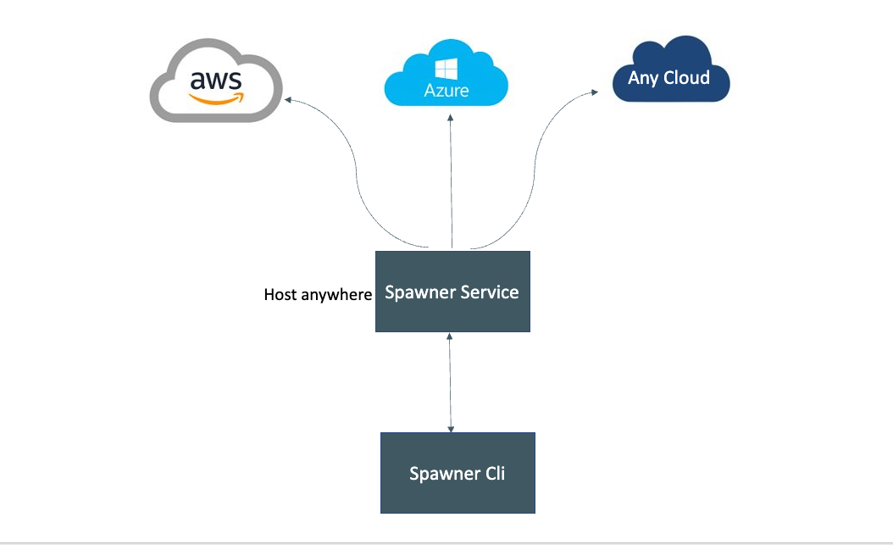

<p align="center" width="100%">
    
</p>


# spawner


Mulit-Cloud infrastructure orchestrator for kubernetes first development. One tool to rule them all. No need to use aws, azure or any other vendor specific cli to manage cluster and get kubeconfig.


[](https://bestpractices.coreinfrastructure.org/projects/5978)
[](https://join.slack.com/t/netbookml/shared_invite/zt-181u18zpv-nImWXM8YPmIkcsBoCcFNJA)

---
## Overview

<p align="center" width="100%" >
    
</p>

- Multi cloud infrastructure orchestrator for kubernetes.
- Manage cluster kubeconfig for different provider.
- Provision nodes with on demand or spot instances.
- Access control built right into spawner, it will not access your existing clusters if it wasnt created by spawner unless your resources tagged as per  spawner policy.

---
### Prerequisites
1. Golang v1.17 or later.


### Usage 

#### Clone repo
 
```
git clone git@gitlab.com:netbook-devs/spawner-service.git
```

Spawner comes with following two packages

* spawner-service - gRPC service to manage cloud provider infra
* spawner  - command line interface to interact with service

#### run service
  
- update config.env with the cloud provider credentials, gRPC ports.

- run the service
  
  Spawner is a gRPC service, so spin up a terminal and run the following command
  ```
  make run
  ```

  this will start the service in the specified ports in config.env

---


### spawner command line tool

#### Build

spin up another terminal/tab and run the following in spawner-service repo directory

```
make build-client
```

#### Install

The previous build will generate the client binary named `spawner` in the current working directory. Copy that to your PATH or use it with relative execution path `./spawner` as per your convenience.

#### Usage

For all the commands you need to pass spawner host address, default value is set to `localhost:8083`, if you need to change that, pass in using `--addr` or `-a`.

Example:

```
spawner cluster-status clustername --addr=192.168.1.78:8080 --provider=aws --region=us-west-2
```

#### Create a new cluster

To create a cluster we need more information on the cluster and node specification which can be passed to command as a file by specifying `--request` or `-r`

```
spawner create-cluster clustername -r request.json
```

request.json should contain the following

```
{
  "provider": "aws",
  "region": "us-east-1",
  "labels": {
    "created_at": "morning"
  },
  "node": {
    "name": "proident",
    "diskSize": 10,
    "labels": {
      "created_by": "alex"
     
    },
    "instance": "m5.xlarge",
    "gpuEnabled": false
  }
}

```

> Note : This wil create a cluster and attach new node to it as per spec, the time taken by this operation completely depends on how fast provider responds.

---

#### Cluster status

Get the cluster status such as CREATING, ACTIVE, DELETING

```
spawner cluster-status clustername --provider "aws" -r=region
```
----

#### Delete Cluster 

Delete the existing cluster
```
spawner delete-cluster clustername --provider "aws" -r=region
```

If the cluster has the nodes attached to it, this operation will fail, you can force delete the cluster which deletes attached node and then deletes the cluster.

To force delete set the `--force` or `-f`

```
spawner delete-cluster clustername --provider "aws" -r=region --force
```

#### Add new nodepool
Create new nodepool in a given cluster

```
spawner nodepool add clustername --request request.json
```

request.json will contain the nodespec for the new nodepool,

```
@request.json

{
  "nodeSpec": {
    "diskSize": 31,
    "name": "prosint",
    "count": 3,
    "instance": "Standard_A2_V2",
    "labels": {
      "created_by": "cli"
    }
  },
  "region": "eastus2",
  "clusterName": "my-cluster",
  "provider": "azure"
}
```
---

#### Delete nodepool

```
spawner nodepool delete clustername --provider "aws" -r=region --nodepool nodepoolname
```

---

#### Get kubeconfg for the cluster
```
spawner kubeconfig clustername --provider "aws" -r=region
```

this will read existing kube config from `~/.kube/config` and merges new cluster config to it, sets the current context as the requested cluster

### TODO

Some of the things we want to bring in the near future, there will be more to come mean time if you have any more ideas/thoughts, please drop in issues or discussion. Happy to address.


- Documentation to spin Spot Instances
- Support GCP
- Support for bare metal servers
- Attaching existing user clusters by adding spawner policy requirement in user cluster.

Also if you like to contribute...

### Contributing
Refer our contributing guidelines [contributing.md](./CONTRIBUTING.md)

### LICENSE
This code is licensed under  GPL-3.0 License
